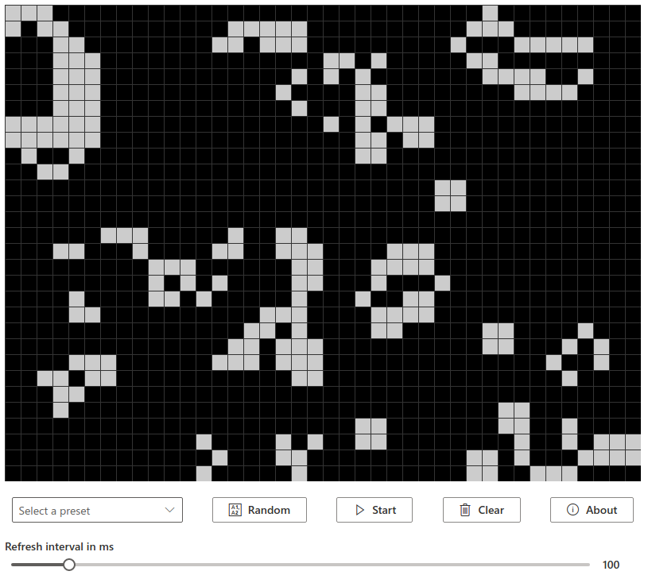

# conways-game-of-life
Simple implementation of Conway's Game of Life using React with TypeScript




## Getting Started

<!-- These instructions will get you a copy of the project up and running on your local machine for development and testing purposes. See deployment for notes on how to deploy the project on a live system. -->

### Prerequisites

You'll need node.js and npm to run this project locally. 

<!-- ### Installing

A step by step series of examples that tell you how to get a development env running

Say what the step will be

```
Give the example
```

And repeat

```
until finished
```

End with an example of getting some data out of the system or using it for a little demo

## Running the tests

Explain how to run the automated tests for this system

### Break down into end to end tests

Explain what these tests test and why

```
Give an example
```

### And coding style tests

Explain what these tests test and why

```
Give an example
```

## Deployment

Add additional notes about how to deploy this on a live system -->

## Built With

* [React](https://reactjs.org/) - A JavaScript library for building user interfaces.
* [TypeScript](https://www.typescriptlang.org/) - TypeScript extends JavaScript by adding types to the language.
* [Fluent UI React](https://developer.microsoft.com/en-us/fluentui#/) - An ecosystem for building highly customizable enterprise class user interfaces.
* [webpack](https://webpack.js.org/) - webpack is a module bundler.
* [Babel](https://babeljs.io/) - Babel is a JavaScript compiler.
* [Jest](https://jestjs.io/) - Jest is a delightful JavaScript Testing Framework with a focus on simplicity.
* [Enzyme](https://enzymejs.github.io/enzyme/) - JavaScript Testing utility for React.
* [ESLint](https://eslint.org/) - Pluggable JavaScript linter.

## Acknowledgments

* Based on project template [react-typescript-boilerplate](https://github.com/davinchee/react-typescript-boilerplate) by **Vincent Chee** 
* Inspired by [react-gameoflife](https://github.com/charlee/react-gameoflife) by **Charlee Li** 
